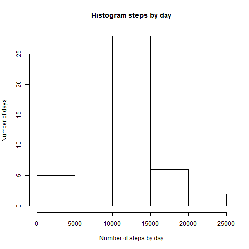
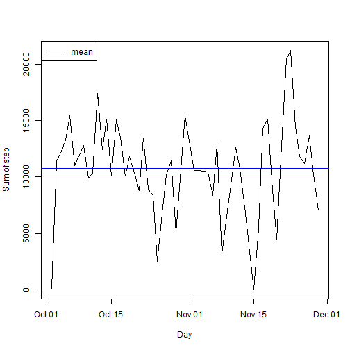
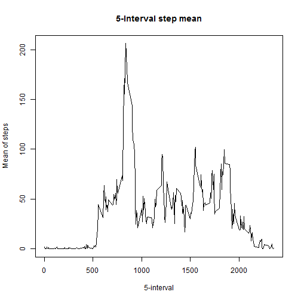
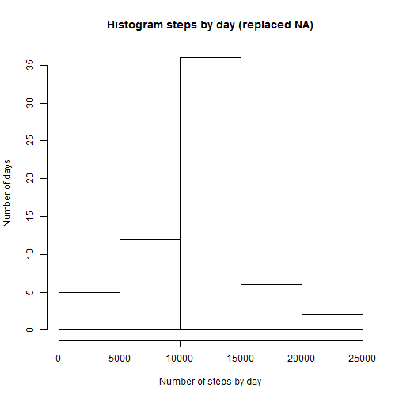
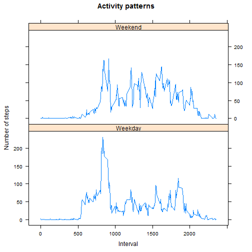

## Introduction
- See [https://github.com/Chajda/RepData_PeerAssessment1/blob/master/README.md] for a description of the Peer Assessment.

## Loading and preprocessing the data
- Input file is in [https://github.com/Chajda/RepData_PeerAssessment1/blob/master/activity.zip]
- After downloading and unzipping to working directory we may load data and basic transfer data:

```r
data <- read.csv("activity.csv", header = TRUE, na.strings="NA")
data$date <- as.Date(data$date, format="%Y-%m-%d")
```


## What is mean total number of steps taken per day?
- For this part of the assignment, we can ignore the missing values in the dataset.

```r
dataWithoutNA <- data[!is.na(data$steps),]
```

- Calculate the total number of steps taken per day

```r
date_group <- aggregate(dataWithoutNA$steps, by=list(dataWithoutNA$date), sum, na.rm=TRUE, na.action=NULL)
names(date_group) <- c('date','steps')
head(date_group)
```

```
##         date steps
## 1 2012-10-02   126
## 2 2012-10-03 11352
## 3 2012-10-04 12116
## 4 2012-10-05 13294
## 5 2012-10-06 15420
## 6 2012-10-07 11015
```

- Make a histogram of the total number of steps taken each day

```r
hist(date_group$steps,
     main = "Histogram steps by day",
     xlab = "Number of steps by day",
     ylab = "Number of days", )
```

 

- Calculate the mean and median of the total number of steps taken per day

```r
avg <- mean(date_group$steps)
avg
```

```
## [1] 10766.19
```

```r
median(date_group$steps)
```

```
## [1] 10765
```


```r
Sys.setlocale("LC_TIME", "English")
```

```
## [1] "English_United States.1252"
```

```r
plot(date_group, type="l",
     main="", ylab="Sum of step", xlab="Day")
abline(h=avg, col="blue")
legend("topleft", legend=c("mean"), col=c("blue"), lty=c(1))
```

 

## What is the average daily activity pattern?
- Calculate mean by interval

```r
interval_group <- aggregate(dataWithoutNA$steps, by=list(dataWithoutNA$interval),
    mean, na.rm=TRUE, na.action=NULL)
names(interval_group) <- c('interval','steps.mean')
head(interval_group)
```

```
##   interval steps.mean
## 1        0  1.7169811
## 2        5  0.3396226
## 3       10  0.1320755
## 4       15  0.1509434
## 5       20  0.0754717
## 6       25  2.0943396
```

```r
# printing graph
plot(interval_group, type="l",
  main = "5-Interval step mean", xlab = "5-interval", ylab = "Mean of steps")
```

 

- Which 5-minute interval, on average across all the days in the dataset, contains the maximum number of steps?

```r
interval_group[interval_group$steps.mean==max(interval_group$steps.mean),]
```

```
##     interval steps.mean
## 104      835   206.1698
```

## Imputing missing values
-  Total number of missing values

```r
sum(is.na(data$steps))
```

```
## [1] 2304
```

- NA values replace average value in interval

```r
library(plyr)
dataAvg <- join(data, interval_group, by="interval", type="left")
dataAvg[is.na(dataAvg$steps),]$steps <- dataAvg[is.na(dataAvg$steps),]$steps.mean
dataAvg$steps.mean <- NULL
head(dataAvg)
```

```
##       steps       date interval
## 1 1.7169811 2012-10-01        0
## 2 0.3396226 2012-10-01        5
## 3 0.1320755 2012-10-01       10
## 4 0.1509434 2012-10-01       15
## 5 0.0754717 2012-10-01       20
## 6 2.0943396 2012-10-01       25
```

- Calculate mean and median of the total number of steps taken per day

```r
mean(date_group$steps)
```

```
## [1] 10766.19
```

```r
median(date_group$steps)
```

```
## [1] 10765
```

- Make a simulate histogram of the total number of steps taken each day

```r
# summary steps by date
dataAvg_group_date <- aggregate(dataAvg$steps, by=list(dataAvg$date), sum,
  na.rm=TRUE, na.action=NULL)
names(dataAvg_group_date) <- c('date','steps')
head(dataAvg_group_date)
```

```
##         date    steps
## 1 2012-10-01 10766.19
## 2 2012-10-02   126.00
## 3 2012-10-03 11352.00
## 4 2012-10-04 12116.00
## 5 2012-10-05 13294.00
## 6 2012-10-06 15420.00
```

```r
# pring histogram
hist(dataAvg_group_date$steps, 
     main = "Histogram steps by day (replaced NA)",
     xlab = "Number of steps by day",
     ylab = "Number of days")
```

 


## Are there differences in activity patterns between weekdays and weekends?

```r
# create new column for weekend/weekday
dataAvg$week <- sapply(
    weekdays(dataAvg$date, abbreviate=TRUE) %in% c("Sat","Sun"),
    function(x) {if (x) "Weekend" else "Weekday"})
# mean steps by interval
dataAvg_group <- aggregate(dataAvg$steps,
    by=list(dataAvg$week, dataAvg$interval),
    mean, na.rm = TRUE, na.action = NULL)
names(dataAvg_group) <- c("weekday", "interval", "mean.steps")
head(dataAvg_group)
```

```
##   weekday interval mean.steps
## 1 Weekday        0 2.25115304
## 2 Weekend        0 0.21462264
## 3 Weekday        5 0.44528302
## 4 Weekend        5 0.04245283
## 5 Weekday       10 0.17316562
## 6 Weekend       10 0.01650943
```

```r
# print graph
library(lattice)
xyplot(dataAvg_group$mean.steps ~ dataAvg_group$interval | 
    dataAvg_group$weekday, layout=c(1,2), type="l",
    main="Activity patterns", xlab="Interval", ylab="Number of steps")
```

 
